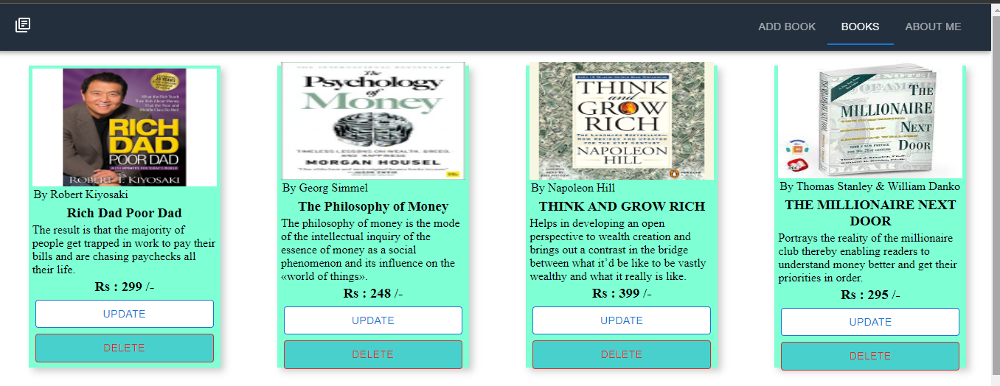
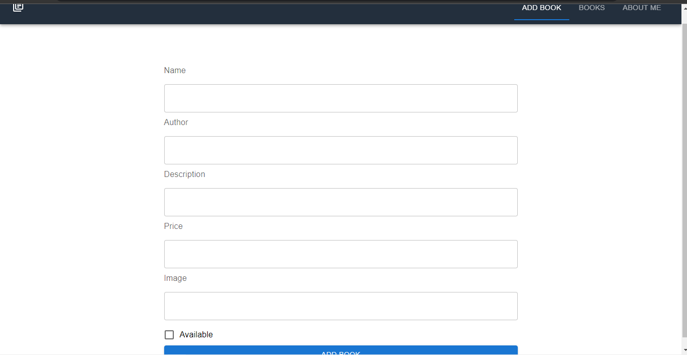
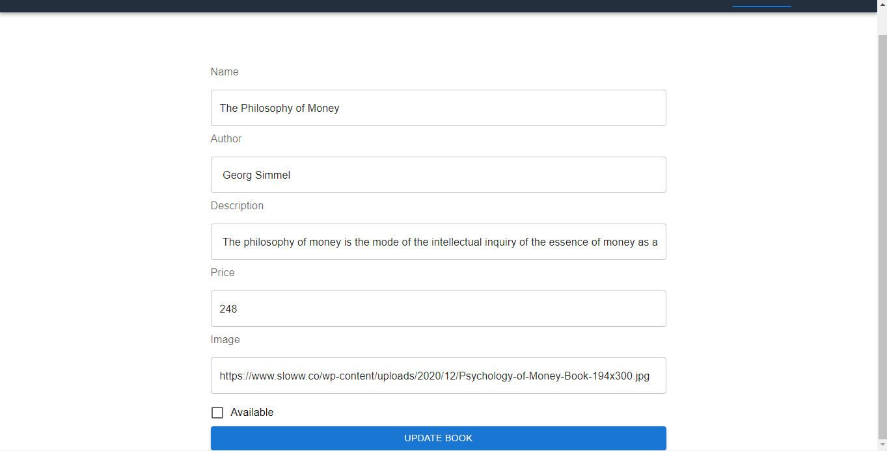
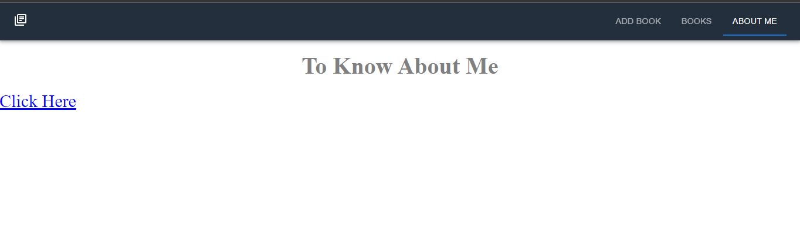

# BookStore

<h1>Webapp ScreenShots : </h1>

<h3 align="center" dir="auto">HOME</h3>

 

<h3 align="center" dir="auto">Add-Book</h3>

 

<h3 align="center" dir="auto">Update Book</h3>

 

<h3 align="center" dir="auto">About Me</h3>

Tech Stack :
 1. React / HTML / CSS / JAVASCRIPT
 2. MongoDB / Node / Express / Mongoose
 
Operations : 
1. C-Create 
2. R-Read
3. U-Update
4. D-Delete
